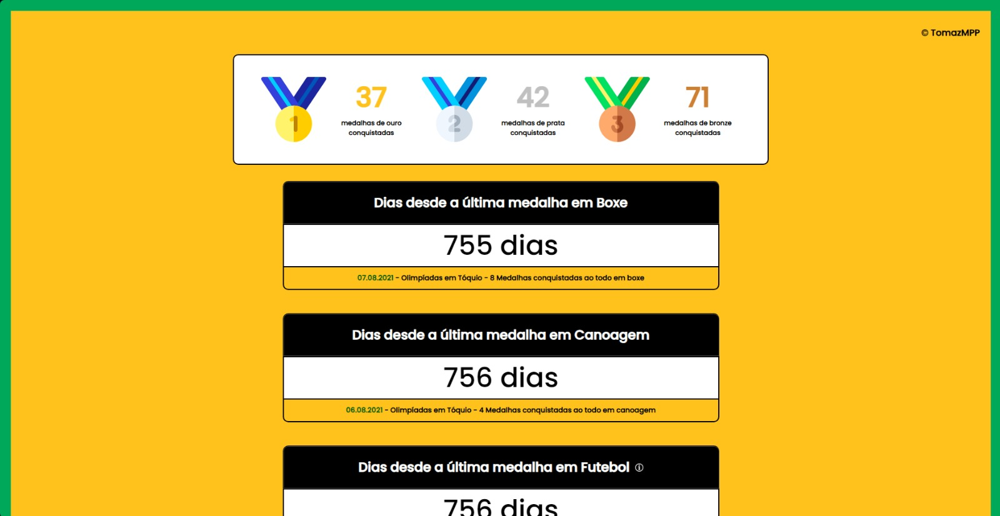
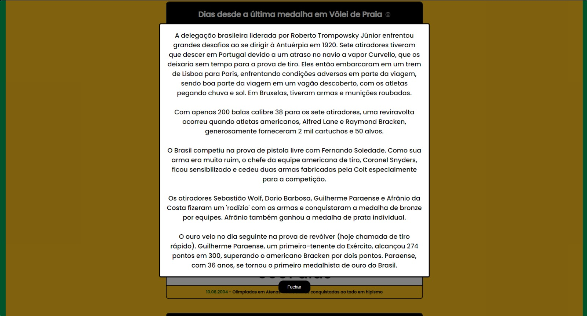

<h1 align="center"></h1>

<a href="https://www.ultimamedalha.com.br" target="_blank">✨ Published version ✨</a>

 

<b> Application about Brazil's recent medals in each sport at the Olympics. It highlights how many days have passed since the last victory, in which edition of the Olympics it occurred, and provides interesting data, such as curious facts related to these wins. Additionally, my site highlights sports in which Brazil has never won medals, even after decades of participation. It's an educational initiative, especially for sports and Olympics enthusiasts.</b>

<b>(PT-BR) Aplicação sobre as medalhas recentes do Brasil em cada esporte nas Olimpíadas. Ele destaca quantos dias se passaram desde a última vitória, em qual edição das Olimpíadas isso ocorreu e fornece dados interessantes, como fatos curiosos relacionados a essas conquistas. Além disso, meu site destaca os esportes nos quais o Brasil nunca conquistou medalhas, mesmo após décadas de participação. É uma iniciativa educacional, especialmente para entusiastas de esportes e das Olimpíadas.</b>

     
  
   

> Personal project, using HTML, CSS and JavaScript.

## Idea
Many times, I sought information about Brazil's latest medal in certain sports, and this information was very hard to find. So I had the idea to create a website with a user-friendly layout to present this data. In addition to that, I added other information, such as interesting facts about the Brazilian federation in certain sports, and the total number of medals won by Brazil.
  (PT-BR) Muitas vezes, busquei informações sobre a última medalha do Brasil em determinados esportes, e essa informação era muito difícil de encontrar. Então, tive a ideia de criar um site com um layout amigável para apresentar esses dados. Além disso, adicionei outras informações, como fatos interessantes sobre a federação brasileira em determinados esportes e o número total de medalhas conquistadas pelo Brasil.

## What did i learn new with this project?
* Improved my skills in CSS and JavaScript

## Author

👤 **Tomaz Pontes**

* Website: https://tomazmpp.github.io
* Twitter: [@tomaz_dev](https://twitter.com/tomaz_dev)
* Github: [@TomazMPP](https://github.com/TomazMPP)
* LinkedIn: [@Tomaz Pontes](https://linkedin.com/in/tomaz-pontes)

## Show your support

Give a ⭐️ if you like this project!
